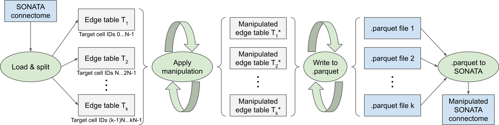

# Connectome Manipulator

~~~
ℹ️ Project: ReSyCo - Rewiring of Synaptic Connectivity
~~~

Applies manipulations to the connectome of a SONATA circuit, and runs a structural and topological comparison of the raw and manipulated connectomes

## Overview

* __/bin__\
  Shell scripts to launch connectome manipulations independently as SLURM jobs
* __/notebooks__\
  Contains the main scripts (Jupyter notebooks) for running connectome manipulations, model building, and visualizations
* __/pipeline__\
  Processing pipeline code, containing the specific implementation of all manipulations, model building, and visualizations
* __/working_dir__\
  Working directory to store all pre-computed results for visualizations (Note: the actual manipulations are stored directly at the circuit location)

## Processing pipeline

* __Connectome manipulator__\
  Depending on the config, applies one or a sequence of manipulations to a given SONATA connectome, and writes the manipulated connectome to a new SONATA file. All manipulations are separately implemented in sub-modules and can be easily extended.

* __Model building__\
  Depending on the config, builds a model from a given connectome and write the model to a file to be loaded and used by some manipulations requiring a model (e.g., for model-based rewiring based on given connection probabilities). All models are separately implemented in sub-modules and can be easily extended.

* __Structural comparator__\
  Performs a structural comparison of the original and manipulated connectomes. Different structural parameters to compare (connection probability, synapses per connection, ...) are separately implemented in sub-modules and can be easily extended.

* __Topological comparator__\
  Performs a topological comparison of the original and manipulated connectomes based on advanced topological metrics.\
  External GitHub project: [MWolfR / topological_comparator](https://github.com/MWolfR/topological_comparator)

|  |
| :---: |
| __Figure:__ Schematic overview of the connectome manipulation pipeline |

## Operation principle of the _Connectome manipulator_

|  |
| :---: |
| __Figure:__ Operation principle of the _Connectome manipulator_ |
