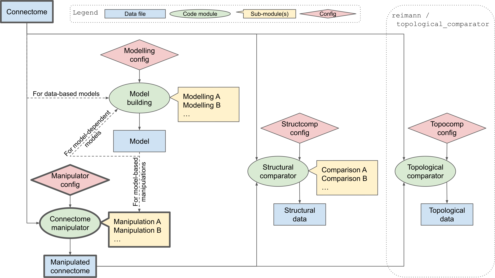
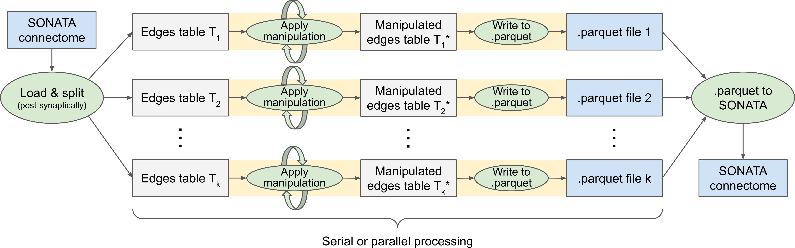

# Connectome Manipulator

~~~
ℹ️ Project: ReSyCo - Rewiring of Synaptic Connectivity
~~~

An important way to study cortical function _in-silico_ lies in manipulations that are impossible to perform _in-vivo_ and _in-vitro_. One type of manipulations includes manipulations of the (micro-)structure of synaptic connections. The aim of this project is to provide a general framework to apply and study structural manipulations of a circuit connectome, referred to as rewiring.

With the tools implemented in this repository, it is possible to apply manipulations to the connectome of a [SONATA](https://github.com/AllenInstitute/sonata/blob/master/docs/SONATA_DEVELOPER_GUIDE.md) circuit, and to run a structural and topological comparison of the raw and manipulated connectomes. Importantly, the resulting (manipulated) SONATA connectomes are intended to be used in neural network simulations, which opens new possibilities for all kinds of simulation experiments to find causal relationships between structure and function.


## Folder overview

* __[/bin](examples/bin)__\
  Shell scripts to launch connectome manipulations independently as SLURM jobs
* __[/images](doc/source/images)__\
  Image files used in documentation pages
* __[/notebooks](examples/ipython_notebooks)__\
  Main scripts (Jupyter notebooks) for setting up and running
  - Connectome manipulations
  - Model building
  - Structural comparisons
  - Topological comparisons \[requires [BluePy v2](https://bbpteam.epfl.ch/documentation/projects/bluepy/latest/) to interface with external [topological_comparator](https://bbpgitlab.epfl.ch/conn/personal/reimann/topological_comparator/-/tree/newbluepy) pipeline\]
* __[/pipeline](connectome_manipulator)__\
  Processing pipeline code, containing the specific implementation of all manipulations, model building, and visualizations
* __/working_dir__\
  Working directory (created at runtime) to store all pre-computed config files and results for analyses and visualizations
  
  > __Note:__ The manipulated connectome is stored directly at the circuit location or at some specified folder path!


## Processing pipeline

The connectome manipulation pipeline is illustrated in Figure 1 and consists of the following modules. The Python library [Blue Brain SNAP](https://github.com/BlueBrain/snap) is used to access SONATA circuits.

* __Connectome manipulator__\
  Depending on the config, applies one or a sequence of manipulations to a given SONATA connectome, and writes the manipulated connectome to a new SONATA file. All manipulations are separately implemented in sub-modules and can be easily extended.\
  Details can be found in the corresponding README file: [/pipeline/connectome_manipulation/README.md](connectome_manipulator/connectome_manipulation/)
* __Model building__\
  Depending on the config, builds a model from a given connectome and writes the model to a file to be loaded and used by some manipulations requiring a model (e.g., model-based rewiring based on given connection probability model). All models are separately implemented in sub-modules and can be easily extended.\
  Details can be found in the corresponding README file: [/pipeline/model_building/README.md](connectome_manipulator/model_building/)
  
  > __Note 1:__ Some models may not even require a connectome as input.
  
  > __Note 2:__ Some models may depend on other models as input for model building.

* __Structural comparator__\
  Performs a structural comparison of the original and manipulated connectomes. Different structural parameters to compare (connection probability, synapses per connection, ...) are separately implemented in sub-modules and can be easily extended.\
  Details can be found in the corresponding README file: [/pipeline/connectome_comparison/README.md](connectome_manipulator/connectome_comparison/)

* __Topological comparator__\
  Performs a topological comparison of the original and manipulated connectomes based on advanced topological metrics.\
  External GitLab project: [reimann / topological_comparator](https://bbpgitlab.epfl.ch/conn/personal/reimann/topological_comparator/-/tree/newbluepy)

|  |
| :-: |
| __Figure 1:__ Schematic overview of the connectome manipulation pipeline, consisting of the _Connectome manipulator_, _Model building_, _Structural comparator_, and _Topological comparator_ modules. |


## Operation principle of the _Connectome manipulator_

As illustrated in Figure 2, the synapses of the connectome (SONATA edges) are divided into k blocks targeting disjoint sets of N post-synaptic neurons (SONATA nodes), which reduces the memory consumption and facilitates parallelization on multiple computation nodes. Each block is an edge table loaded as Pandas dataframe and comprising a list of synapses together with all synapse properties, an example is shown in Figure 3. The manipulations are then applied separately to each edge table in sequence (or alternatively, in parallel), resulting in manipulated edge tables which are then written to separate .parquet files. In the end, all .parquet files are merged into one manipulated SONATA connectome file using [Parquet Converters](https://bbpgitlab.epfl.ch/hpc/circuit-building/parquet-converters).

> __Note 1:__ A SONATA edges file is expected to contain a single edge population (to be manipulated) connecting two arbitrary source/target node populations.

> __Note 2:__ All synapses belonging to a certain pre-post connection are always within the same edge table.

> __Note 3:__ The synapses in each loaded edge table are assumed to be sorted by post-synaptic neuron ID. Likewise, the manipulated edge tables are to be returned with synapses sorted by post-synaptic neuron ID.

> __Note 4:__ Synapse indices do not need to be unique across all manipulated edge tables, as synapse indices are not stored in the resulting SONATA connectome.

> __Note 5:__ By default, all blocks are being processed and existing .parquet files will be overwritten. Optionally, processing can be resumed from an earlier (incomplete) run, re-using all .parquet files that already exist, instead of re-computing them.

> __Note 6:__ By default, all .parquet files will be deleted after successfull completion, i.e., after the manipulated SONATA connectome file has been generated. Optionally, these temporary .parquet files can be kept as well.

|  |
| :-: |
| __Figure 2:__ Operation principle of the _Connectome manipulator_, illustrating the block-based processing architecture. |

|  comprising all synapse properties.") |
| :-: |
| __Figure 3:__ Example of an edge table (Pandas dataframe), comprising a list of synapses together with all synapse properties. |


## Developing in connectome-manipulator

### Getting started

Best is to setup a virtual environment to install all the dependencies and the package itself in
place for easy testing.

```
module load unstable python-dev parquet-converters/0.8.0 git
mkdir cm_dev && cd cm_dev
git clone git@bbpgitlab.epfl.ch:conn/structural/connectome_manipulator.git
python3 -m venv venv && source venv/bin/activate
export PIP_INDEX_URL=https://bbpteam.epfl.ch/repository/devpi/simple
cd connectome_manipulator
pip install -e .
pip install -U tox pytest libsonata
```

### Testing

The project has a CI setup that will run unit, functional and integration tests in gitlab.
Everything is driven by tox, so you can also easily run things locally to make sure your changes did
not break anything before pushing any code.

```
tox -e lint # will run the code and doc linters
tox -e 310 # will run pytest
tox -e functional # will run more complete functional tests
```

### Running benchmarks

If you really want to test bigger things, best is to look inside one of our benchmarking
directories:

```
/gpfs/bbp.cscs.ch/data/scratch/proj134/home/pokorny/BBPP134-225
```

You'll find a number of configuration files of differnet sizes

```
wiring_config_v2__whole_brain__ER_100k.json
wiring_config_v2__whole_brain__ER_10M.json
wiring_config_v2__whole_brain__ER_1M.json
wiring_config_v2__whole_brain__ER.json
wiring_config_v3__whole_brain__ER_100.json
wiring_config_v3__whole_brain__ER_100k.json
wiring_config_v3__whole_brain__ER_10.json
wiring_config_v3__whole_brain__ER_10k.json
wiring_config_v3__whole_brain__ER_1.json
wiring_config_v3__whole_brain__ER_1k.json
wiring_config_v3__whole_brain__ER.json
```

v2 is for the current `main` branch, while v3 is for the new connectivity model that is the
`pathway_reduction` branch. The number at the end indicates the number of pathways

The same directory also shows you how to run connectome-manipulator:

```
Usage: connectome-manipulator manipulate-connectome [OPTIONS] CONFIG

  Manipulate or build a circuit's connectome.

Options:
  --output-dir TEXT               Output directory.  [required]
  --profile                       Enable profiling.  [default: False]
  --resume                        Resume from exisiting .parquet files.
                                  [default: False]
  --keep-parquet                  Keep temporary parquet files.  [default:
                                  False]
  --convert-to-sonata             Convert parquet to sonata and generate
                                  circuit config  [default: False]
  --overwrite-edges               Overwrite existing edges file  [default:
                                  False]
  --splits INTEGER                Number of blocks, overwrites value in config
                                  file
  --target-payload INTEGER        Number of gid-gid pairs to consider for one block.
                                  Supersedes splits when a parquet based configuration
                                  is used  [default: 20000000000]
  --parallel                      Run using a parallel DASK job scheduler  [default:
                                  False]
  -a, --parallel-arg TEXT         Overwrite the arguments for the Dask Client with
                                  key=value
  --help                          Show this message and exit.  [default:
                                  False]
```

Just running serially you can do something like this:

```
connectome-manipulator manipulate-connectome wiring_config_v3__whole_brain__ER_1.json \
    --output-dir ${OUTPATH} --profile --splits 1
```

Running in parallel (with Dask) you can use the `parallel-manipulator` executable that
will set up Dask automatically (and switch the `--parallel` flag to default to `True`,
too):
```
srun --nodes 10 --tasks-per-node=2 --cpus-per-task=20 --constraint=clx --mem=0 \
    parallel-manipulator manipulate-connectome wiring_config_v3__whole_brain__ER_1.json --profile
```
*Please note that this feature will require at least 4 MPI ranks*. Dask will use 2 ranks
to manage the distributed cluster.
We recommend to use a high number for `--cpus-per-task` to create Dask workers that will
be able to process a lot of data in parallel.

When processing with `parallel-manipulator`, one may pass the flag `--target-payload` to
determine how big the individual workload for each process should be. The default value of
20e9 was determined empirically to run on the whole mouse brain with 75 million neurons.
We recommend to use this value as a starting point and scale it up or down to achieve the
desired runtime characteristics.

### Profiling the code

Unfortunately the latest version of arm map wth python 3.10 refuses to run on this code, that's why
it's easiest to have a separate venv setup that uses python 3.9.7 and run the profiler like that

```
module purge
module load archive/2023-02 python-dev parquet-converters/0.8.0 arm-forge/22.0.3-Linux-x86_64
python3 -m venv venv_397 && source venv_397/bin/activate
export PIP_INDEX_URL=https://bbpteam.epfl.ch/repository/devpi/simple
cd connectome_manipulator
pip install -e .
pip install -U tox pytest libsonata
cd ../run_directory
map --verbose --profile --no-mpi --output $OUTPATH/profile_whole_brain_ER_1-6.map \
  python -m connectome_manipulator.cli manipulate-connectome wiring_config_v3__whole_brain__ER_1.json \
  --output-dir ${OUTPATH} --profile --splits 1
```
