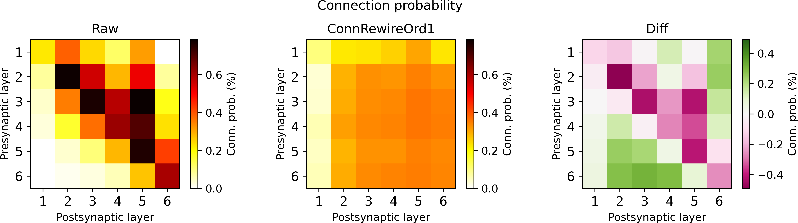
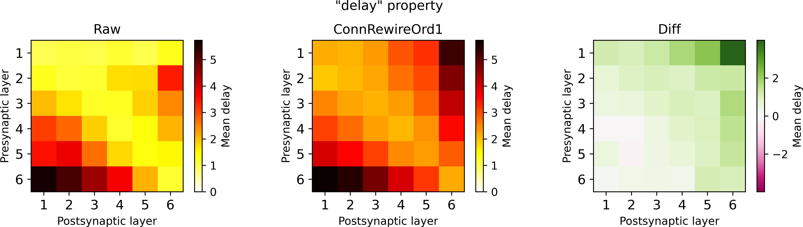

# Structural comparisons overview

| File | Description | Example |
| :-- | :-- | :-- |
| __[/adjacency.py](adjacency.py)__ | __Adjacency matrix__   Connectivity between pairs of pre-/postsynaptic neurons   Optionally:   Numbers of synapses per connection |  |
| __[/connectivity.py](connectivity.py)__ | __Connectivity matrix__   Connection probability and #synapses/connection between selected groups of neurons (layers, m-types, ...) |  |
| __[/properties.py](properties.py)__ | __Property matrix__   Mean/std/... values of synapse properties between selected groups of neurons (layers, m-types, ...) |  |
