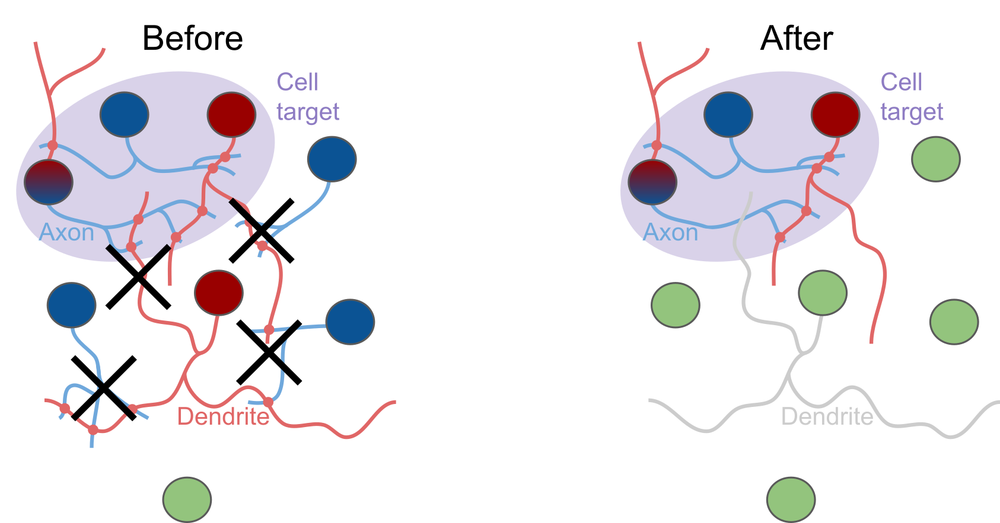
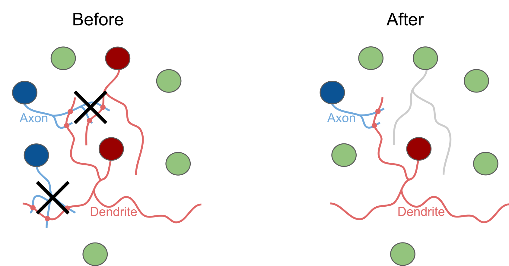
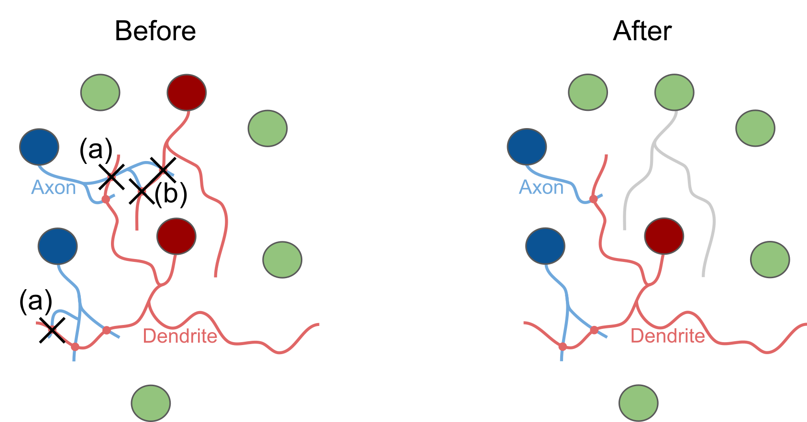
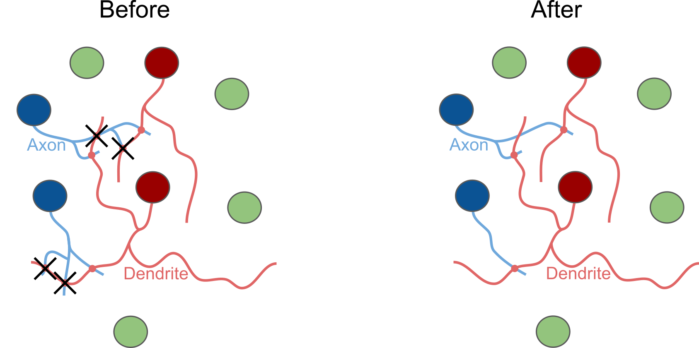
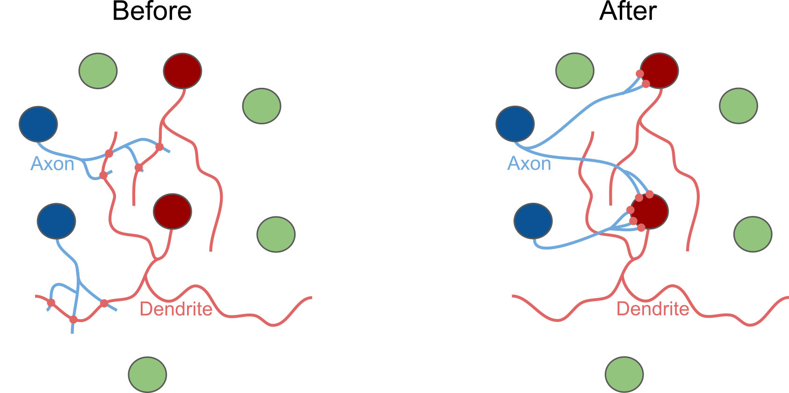
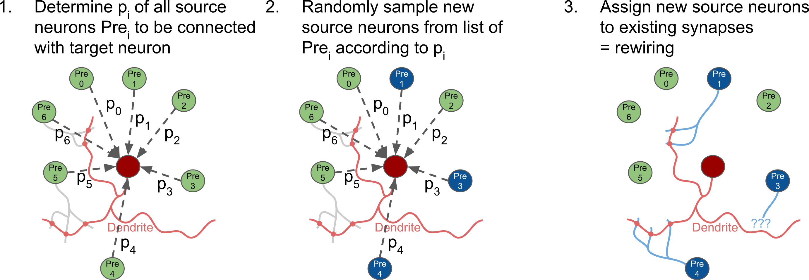
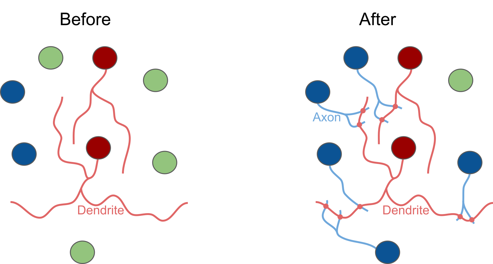
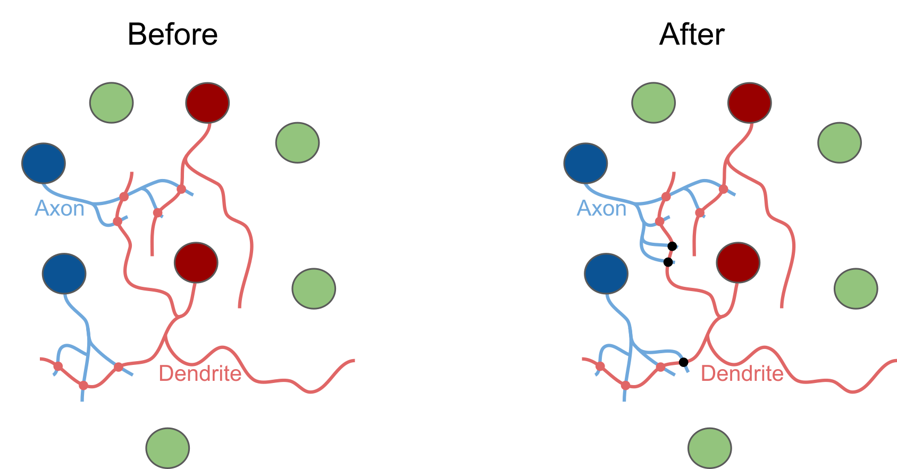

# Manipulations overview

| File | Description | Example |
| :-- | :-- | :-- |
| __[/no_manipulation.py](no_manipulation.py)__ | __No manipulation__   This is just a dummy manipulation function performing no manipulation at all. This function is intended as a control condition to run the manipulation pipeline without actually manipulating the connectome. |  |
| __[/conn_extraction.py](conn_extraction.py)__ | __Connection extraction__   Extracts the connectome of a given cell target (i.e., a named group of neurons, a.k.a. node set), keeping only connections among these target cells. Cell targets intrinsic to a circuit or provided through an external SONATA node sets file containing lists of GIDs (.json) are supported. If no cell target is specified, an empty connectome file is returned. The nodes (cell) table is always kept unchanged. |  |
| __[/conn_removal.py](conn_removal.py)__ | __Connection removal__   Removes a certain percentage of connections (i.e., all synapses belonging to a connection) between selected groups of neurons (layers, m-types, ...), optionally removing only connections within a certain range of #synapses/connection and/or within a connection mask (sparse adjacency matrix). |  |
| __[/syn_removal.py](syn_removal.py)__ | __Synapse removal__   Removes a certain percentage of synapses between selected groups of neurons (layers, m-types, ...), resulting in (a) reduced #synapses/connection or (b) removed connections (i.e., all synapses of a connection removed). |  |
|                     | Optionally:   Keeping connections (i.e., at least 1 synapse/connection kept). |  |
|                     | Optionally:   Re-scaling conductances G* of remaining synapses to keep sum of conductances per connection constant (unless whole connection is removed). |  |
| __[/syn_prop_alteration.py](syn_prop_alteration.py)__ | __Synapse property alteration__   Alters values of certain synapse properties (e.g., conductance, delay, ...) of a certain percentage of synapses between selected groups of neurons (layers, m-types, ...) by setting them to a new absolute value, relative scaling, randomizing, ...   Example: Afferent section pos/ID set to 0 (= soma) |  |
| __[/conn_rewiring.py](conn_rewiring.py)__ | __Connection rewiring__   Rewiring of connections between pairs of neurons based on a given connection probability model and re-using existing synapses, (a) preserving #synapses/connections, (b) duplicating existing synapses to form new connections (and parametrizing them by randomly sampling synaptic property values from other existing synapses), and (c) removing unused synapses.   Optionally: Preserving in-degrees and #synapses/connections, without adding or deleting synapses. |  |
| | Algorithm: For each post-synaptic target neuron...      | |
| __[/conn_wiring.py](conn_wiring.py)__ | __Connectome wiring__   Special case of connectome rewiring, which wires an empty connectome from scratch, or simply adds connections to an existing connectome, based on a given connection probability model.    ℹ️ Only specific properties like source/target node, afferent synapse positions, synapse type (INH: 0, EXC: 100), and delay (optional) will be generated. |  |

<!--[NOT READY/TESTED]| __[/syn_addition.py](syn_addition.py)__ | __Synapse addition__   Adds a certain number of synapses (e.g., total percentage, percentage per connection, ...) to existing connections between selected groups of neurons (layers, m-types, ...) by (i) duplicating existing synapses, (ii) deriving from existing synapses (duplicating and randomizing certain properties based on a model), or (iii) loading from an external connectome.   Optionally: Re-scaling gSyns (conductances) to keep sum of gSyns per connection constant. |  |-->

## Note:
In general, each connectome manipulation function must contain a definition of <code>apply(edges_table, nodes, aux_dict, ...)</code>:
- The first three parameters are always: <code>edges_table</code>, <code>nodes</code>, <code>aux_dict</code>
- <code>aux_dict</code> contains information about data splits; may also be used to pass global information from one split iteration to another
- Other parameters may be added (optional)
- Returns a manipulated <code>edges_table</code>