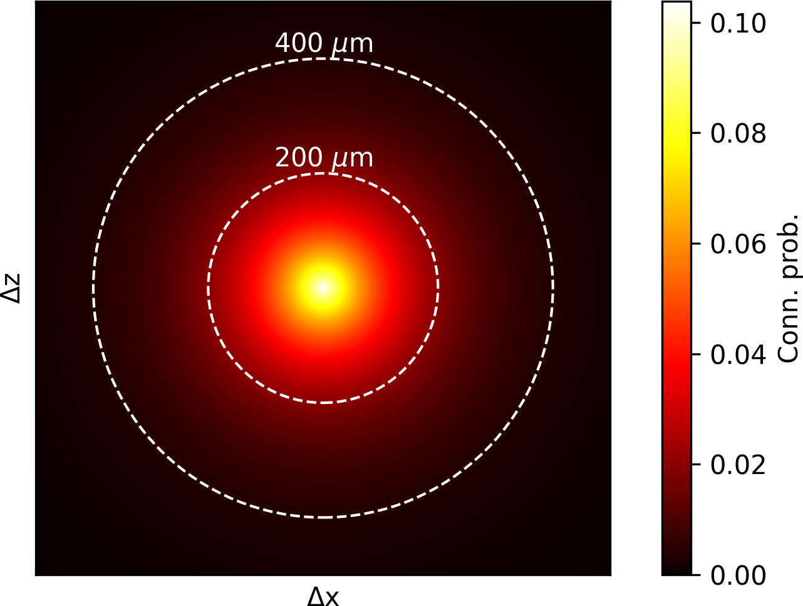
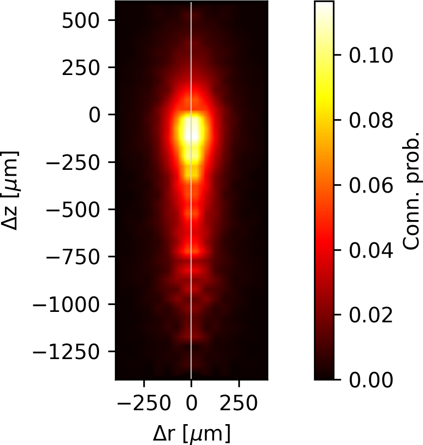
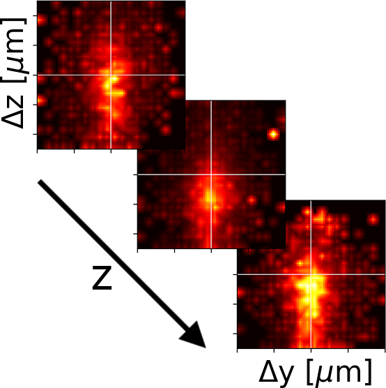
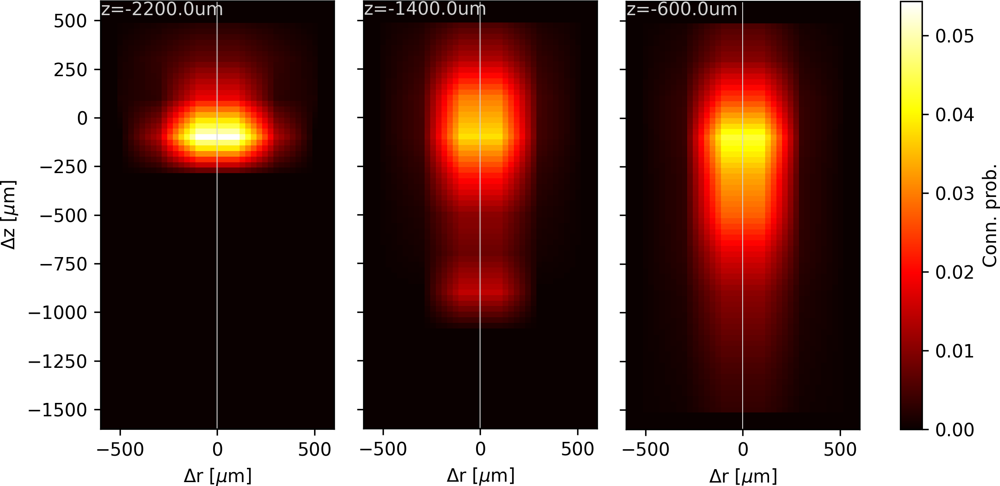
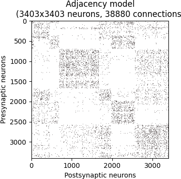
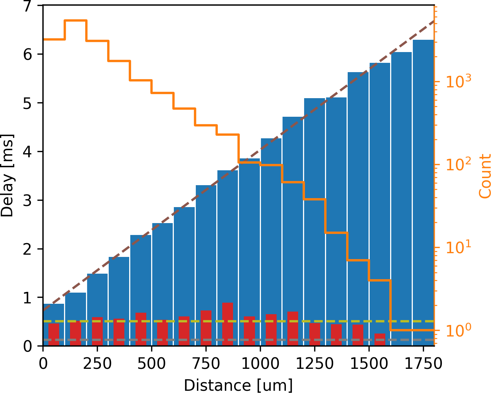
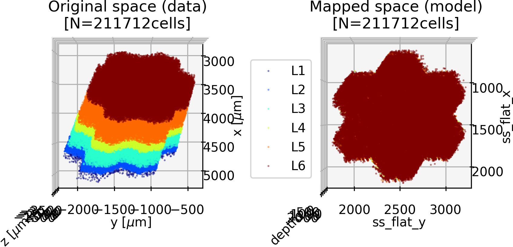

# Models building overview

Extracting models from existing connectomes or related data.

| File | Description | Example |
| :-- | :-- | :-- |
| __[/conn_prob.py](conn_prob.py)__ | __Connection probability model__   <ul><li><code>'order': 1</code></li></ul> 1st order model [[Gal et al. 2020]](https://www.biorxiv.org/content/10.1101/656058v3 "E Gal, R Perin, H Markram, M London, I Segev. Neuron Geometry Underlies Universal Network Features in Cortical Microcircuits. bioRxiv, 2020, 656058."): Erdős-Rényi (constant) |  |
| | <ul><li><code>'order': 2</code></li></ul> 2nd order model [[Gal et al. 2020]](https://www.biorxiv.org/content/10.1101/656058v3 "E Gal, R Perin, H Markram, M London, I Segev. Neuron Geometry Underlies Universal Network Features in Cortical Microcircuits. bioRxiv, 2020, 656058."): Distance dependent model (exponential fit)    ℹ️ _Position mapping_ supported! |  |
| | <ul><li><code>'order': 3</code></li></ul> 3rd order model [[Gal et al. 2020]](https://www.biorxiv.org/content/10.1101/656058v3 "E Gal, R Perin, H Markram, M London, I Segev. Neuron Geometry Underlies Universal Network Features in Cortical Microcircuits. bioRxiv, 2020, 656058."): Bipolar distance dependent model (exponential fit)    ℹ️ _Position mapping_ supported! |  |
| | <ul><li><code>'order': 4</code></li></ul> 4th order model [[Gal et al. 2020]](https://www.biorxiv.org/content/10.1101/656058v3 "E Gal, R Perin, H Markram, M London, I Segev. Neuron Geometry Underlies Universal Network Features in Cortical Microcircuits. bioRxiv, 2020, 656058."): Offset dependent  model based on linear interpolation    ℹ️ _Position mapping_ supported! |  |
| | <ul><li><code>'order': '4R'</code></li></ul> 4th order reduced model [Modified from [Gal et al. 2020](https://www.biorxiv.org/content/10.1101/656058v3 "E Gal, R Perin, H Markram, M London, I Segev. Neuron Geometry Underlies Universal Network Features in Cortical Microcircuits. bioRxiv, 2020, 656058.")]: Offset dependent  model (linear interpolation), reduced to radial (Δr; instead of Δx, Δy) and axial (Δz) offsets    ℹ️ _Position mapping_ supported! |  |
| | <ul><li><code>'order': 5</code></li></ul> 5th order model [[Gal et al. 2020]](https://www.biorxiv.org/content/10.1101/656058v3 "E Gal, R Perin, H Markram, M London, I Segev. Neuron Geometry Underlies Universal Network Features in Cortical Microcircuits. bioRxiv, 2020, 656058."): Position dependent  model based on linear interpolation    ℹ️ _Position mapping_ supported! |  |
| | <ul><li><code>'order': '5R'</code></li></ul> 5th order reduced model [Modified from [Gal et al. 2020](https://www.biorxiv.org/content/10.1101/656058v3 "E Gal, R Perin, H Markram, M London, I Segev. Neuron Geometry Underlies Universal Network Features in Cortical Microcircuits. bioRxiv, 2020, 656058.")]: Position dependent  model (linear interpolation), reduced to axial position (z; instead of x, y, and z) and radial (Δr; instead of Δx, Δy) and axial (Δz) offsets    ℹ️ _Position mapping_ supported! |  |
| __[/conn_prob_adj.py](conn_prob_adj.py)__ | __Adjacency model__   Deterministic connection probability model (containing only probabilities 0.0 or 1.0) based on an adjacency matrix between pre- and post-synaptic neurons. |  |
| __[/delay.py](delay.py)__ | __Axonal delay model__   Model for linear distance-dependent axonal delays between soma of source neuron and synapse location on target dendrite. |  |
| __[/conn_props.py](conn_props.py)__ | __Connection properties model__   Interpolation model for synaptic property distributions (e.g., conducance, #synapses/connection, depression time, facilitation time, ...) of connections between pairs of source/target neurons belonging to different m-types. | ") |
| __[/pos_mapping.py](pos_mapping.py)__ | __Position mapping model__   Neuron position mapping from atlas space to flat space.    ℹ️ [Blue Brain - Voxcell](https://bbpteam.epfl.ch/documentation/projects/voxcell/latest/index.html#) required! | ") |
| __[/pos_mapping_from_table.py](pos_mapping_from_table.py)__ | __Position mapping model (from table)__   Neuron position mapping loaded from pre-computed table (pandas DataFrame). |  |

Copyright (c) 2024 Blue Brain Project/EPFL