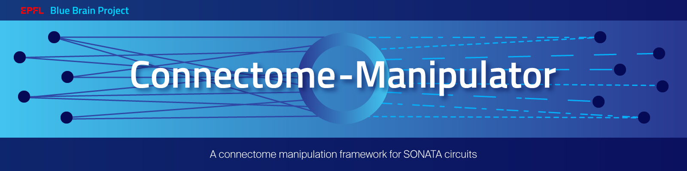
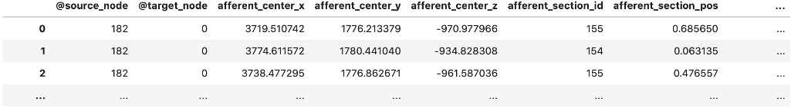

.. Connectome-Manipulator documentation master file, created by
   sphinx-quickstart on Fri Jul 12 09:43:51 2024.
   You can adapt this file completely to your liking, but it should at least
   contain the root `toctree` directive.

.. include:: ../../README.rst
   :end-before: .. substitutions

.. toctree::
   :hidden:
   :maxdepth: 2

   Home <self>
   changelog
   Manipulations overview (on GitHub) <https://github.com/BlueBrain/connectome-manipulator/blob/main/connectome_manipulator/connectome_manipulation/README.md>
   Model building overview (on GitHub) <https://github.com/BlueBrain/connectome-manipulator/blob/main/connectome_manipulator/model_building/README.md>
   Structural comparisons overview (on GitHub) <https://github.com/BlueBrain/connectome-manipulator/blob/main/connectome_manipulator/connectome_comparison/README.md>
   Examples (on GitHub) <https://github.com/BlueBrain/connectome-manipulator/tree/main/examples>
   api

.. Path substitutions

.. |schematic| image:: images/schematic_overview.png
.. |operation| image:: images/operation_principle.png

