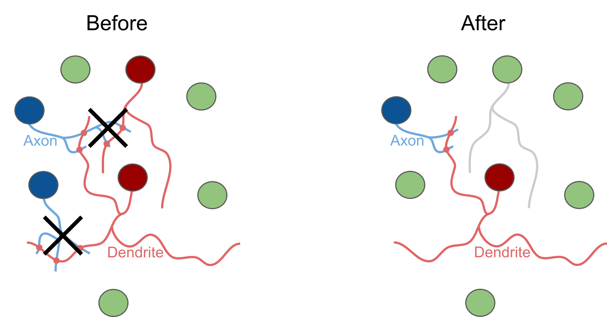
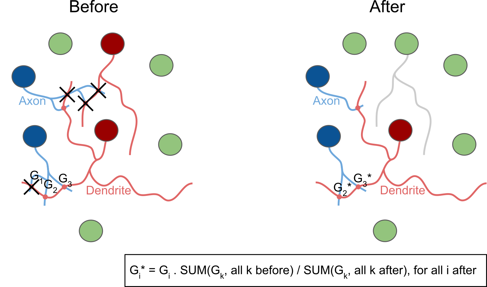
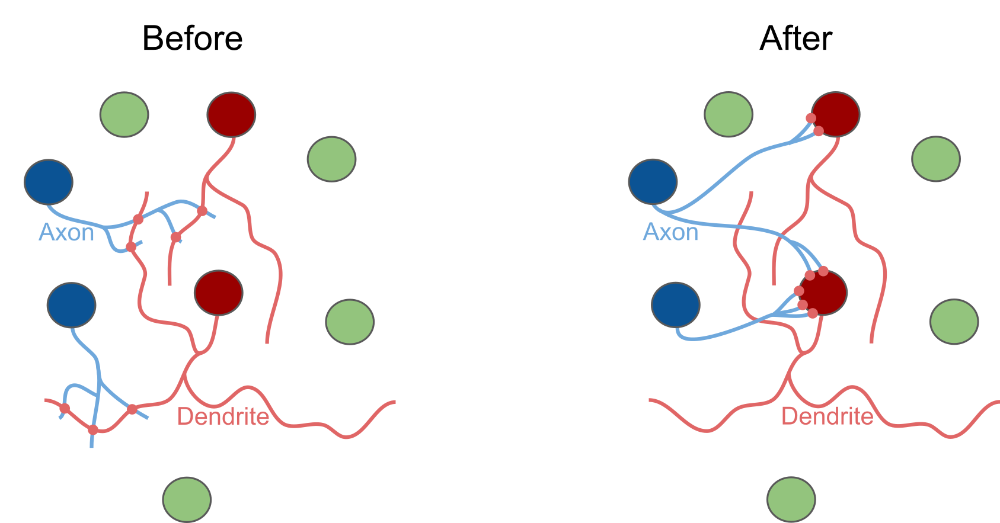
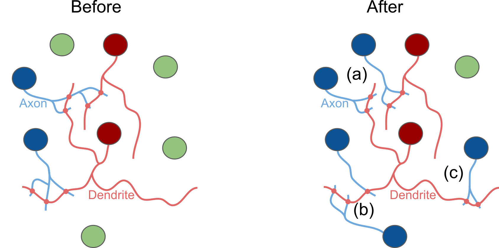
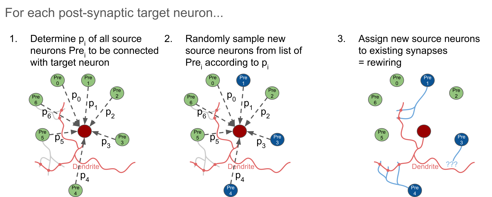

# Manipulations overview

| File | Description | Illustration |
| :-- | :-- | :-- |
| __[/no_manipulation.py](no_manipulation.py)__ | __No manipulation__   This is just a dummy manipulation function performing no manipulation at all. This function is intended as a control condition to run the manipulation pipeline without actually manipulating the connectome. |  |
| __[/conn_removal.py](conn_removal.py)__ | __Connection removal__   Removes a certain percentage of connections (i.e., all synapses belonging to a connection) between selected groups of neurons (layers, m-types, ...), optionally removing only connections within a certain range of #synapses/connection. |  |
| __[/syn_removal.py](syn_removal.py)__ | __Synapse removal__   Removes a certain percentage of synapses between selected groups of neurons (layers, m-types, ...), resulting in (a) reduced #synapses/connection or (b) removed connections (i.e., all synapses of a connection removed). |  |
|                     | Optionally:   Keeping connections (i.e., at least 1 synapse/connection kept). |  |
|                     | Optionally:   Re-scaling conductances G* of remaining synapses to keep sum of conductances per connection constant (unless whole connection is removed). |  |
| __[/syn_prop_alteration.py](syn_prop_alteration.py)__ | __Synapse property alteration__   Alters values of certain synapse properties (e.g., conductance, delay, ...) of a certain percentage of synapses between selected groups of neurons (layers, m-types, ...) by setting them to a new absolute value, relative scaling, randomizing, ...   Example: Afferent section pos/ID set to 0 (= soma) |  |
| __[/syn_addition.py](syn_addition.py)__ | __Synapse addition__   Adds a certain number of synapses (e.g., total percentage, percentage per connection, ...) to existing connections between selected groups of neurons (layers, m-types, ...) by (i) duplicating existing synapses, (ii) deriving from existing synapses (duplicating and randomizing certain properties based on a model) [not yet implemented], or (iii) loading from an external connectome [not yet implemented].   Optionally: Re-scaling gSyns (conductances) to keep sum of gSyns per connection constant. |  |
| __[/conn_rewiring.py](conn_rewiring.py)__ | __Connection rewiring__   Rewiring of connections between pairs of neurons based on a given connection probability model, re-using existing synapses (a) preserving #synapses/connections or (b) not preserving #synapses/connections, or (c) adding new synapses, if needed [not yet implemented]. |  |
| | Algorithm: For each post-synaptic target neuron...      | |
