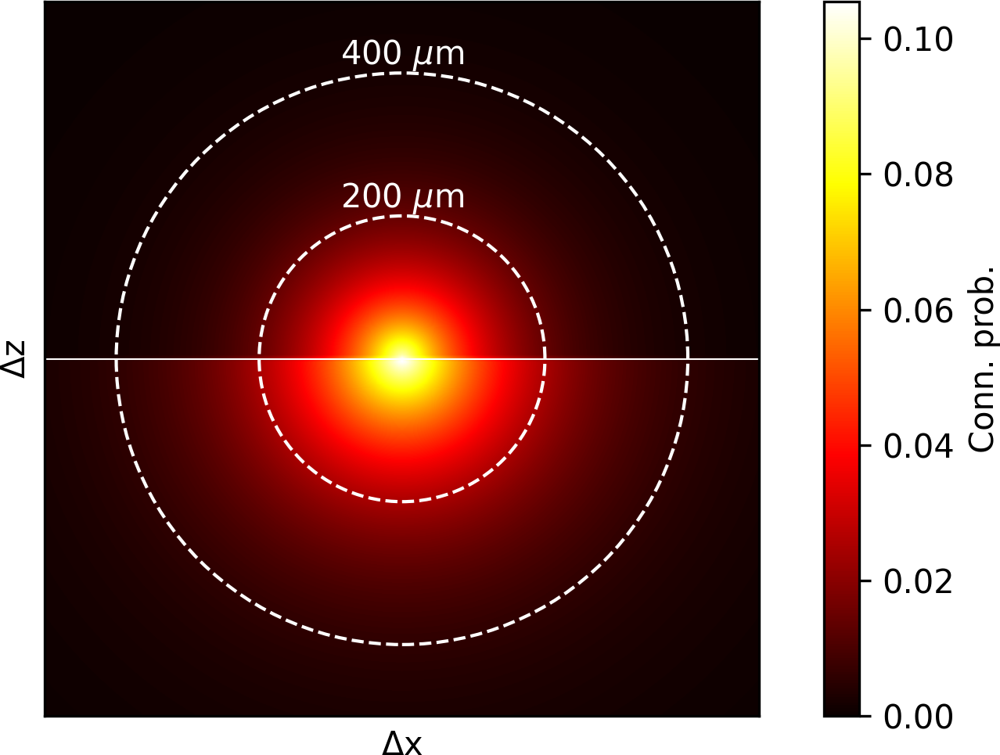
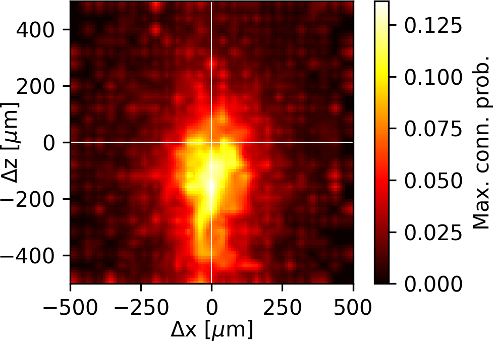

# Models overview

| File | Description | Example |
| :-- | :-- | :-- |
| __[/conn_prob.py](conn_prob.py)__ | __Connection probability model__   1st order model [[Gal et al. 2020]](https://www.biorxiv.org/content/10.1101/656058v3 "E Gal, R Perin, H Markram, M London, I Segev. Neuron Geometry Underlies Universal Network Features in Cortical Microcircuits. bioRxiv, 2020, 656058."): Erdős-Rényi (constant) |  |
| | 2nd order model [[Gal et al. 2020]](https://www.biorxiv.org/content/10.1101/656058v3 "E Gal, R Perin, H Markram, M London, I Segev. Neuron Geometry Underlies Universal Network Features in Cortical Microcircuits. bioRxiv, 2020, 656058."): Distance dependent model (exponential fit)    ℹ️ _Position mapping_ supported! |  |
| | 3rd order model [[Gal et al. 2020]](https://www.biorxiv.org/content/10.1101/656058v3 "E Gal, R Perin, H Markram, M London, I Segev. Neuron Geometry Underlies Universal Network Features in Cortical Microcircuits. bioRxiv, 2020, 656058."): Bipolar distance dependent model (exponential fit)    ℹ️ _Position mapping_ supported! |  |
| | 4th order model [[Gal et al. 2020]](https://www.biorxiv.org/content/10.1101/656058v3 "E Gal, R Perin, H Markram, M London, I Segev. Neuron Geometry Underlies Universal Network Features in Cortical Microcircuits. bioRxiv, 2020, 656058."): Offset dependent  model (linear interpolation or random forest regression)    ℹ️ _Position mapping_ supported! |  |
| __[/delay.py](delay.py)__ | __Axonal delay model__   Model for linear distance-dependent axonal delays between soma of source neuron and synapse location on target dendrite. |  |
| __[/conn_props.py](conn_props.py)__ | __Connection properties model__   Interpolation model for synaptic property distributions (e.g., conducance, #synapses/connection, depression time, facilitation time, ...) of connections between pairs of source/target neurons belonging to different m-types. | ") |
| __[/pos_mapping.py](pos_mapping.py)__ | __Position mapping model__   Neuron position mapping from atlas space to flat space. | ") |
